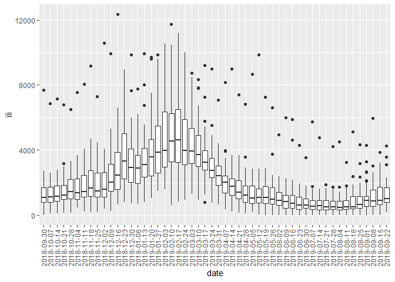

LF2649 HW01
================

# Import data

``` r
hw1 = 
  read_csv("./da_ILINet.csv") %>% 
  janitor::clean_names()
```

    ## Parsed with column specification:
    ## cols(
    ##   .default = col_double(),
    ##   Date = col_date(format = ""),
    ##   Florida = col_logical()
    ## )

    ## See spec(...) for full column specifications.

``` r
head(hw1)
```

    ## # A tibble: 6 x 55
    ##   date       alabama alaska arizona arkansas california colorado connecticut
    ##   <date>       <dbl>  <dbl>   <dbl>    <dbl>      <dbl>    <dbl>       <dbl>
    ## 1 2018-09-30    1627   1959    1735     1105       1481     2081        1501
    ## 2 2018-10-07    1724   2376    1674     1117       1272     2339        1539
    ## 3 2018-10-14    1833   2270    1792     1640       1428     2585        1323
    ## 4 2018-10-21    2242   1005    1615     1490       1583     2297        1617
    ## 5 2018-10-28    2382   2447    2019     2197       1764     2607        1846
    ## 6 2018-11-04    2768   2063    2057     1984       1866     2740        2277
    ## # ... with 47 more variables: delaware <dbl>, district_of_columbia <dbl>,
    ## #   florida <lgl>, georgia <dbl>, hawaii <dbl>, idaho <dbl>, illinois <dbl>,
    ## #   indiana <dbl>, iowa <dbl>, kansas <dbl>, kentucky <dbl>, louisiana <dbl>,
    ## #   maine <dbl>, maryland <dbl>, massachusetts <dbl>, michigan <dbl>,
    ## #   minnesota <dbl>, mississippi <dbl>, missouri <dbl>, montana <dbl>,
    ## #   nebraska <dbl>, nevada <dbl>, new_hampshire <dbl>, new_jersey <dbl>,
    ## #   new_mexico <dbl>, new_york <dbl>, new_york_city <dbl>,
    ## #   north_carolina <dbl>, north_dakota <dbl>, ohio <dbl>, oklahoma <dbl>,
    ## #   oregon <dbl>, pennsylvania <dbl>, puerto_rico <dbl>, rhode_island <dbl>,
    ## #   south_carolina <dbl>, south_dakota <dbl>, tennessee <dbl>, texas <dbl>,
    ## #   utah <dbl>, vermont <dbl>, virgin_islands <dbl>, virginia <dbl>,
    ## #   washington <dbl>, west_virginia <dbl>, wisconsin <dbl>, wyoming <dbl>

# Question 1

## 1.1 What variables does the dataset contain? How many weeks are included for each variable in the dataset?

``` r
colnames(hw1)
```

    ##  [1] "date"                 "alabama"              "alaska"              
    ##  [4] "arizona"              "arkansas"             "california"          
    ##  [7] "colorado"             "connecticut"          "delaware"            
    ## [10] "district_of_columbia" "florida"              "georgia"             
    ## [13] "hawaii"               "idaho"                "illinois"            
    ## [16] "indiana"              "iowa"                 "kansas"              
    ## [19] "kentucky"             "louisiana"            "maine"               
    ## [22] "maryland"             "massachusetts"        "michigan"            
    ## [25] "minnesota"            "mississippi"          "missouri"            
    ## [28] "montana"              "nebraska"             "nevada"              
    ## [31] "new_hampshire"        "new_jersey"           "new_mexico"          
    ## [34] "new_york"             "new_york_city"        "north_carolina"      
    ## [37] "north_dakota"         "ohio"                 "oklahoma"            
    ## [40] "oregon"               "pennsylvania"         "puerto_rico"         
    ## [43] "rhode_island"         "south_carolina"       "south_dakota"        
    ## [46] "tennessee"            "texas"                "utah"                
    ## [49] "vermont"              "virgin_islands"       "virginia"            
    ## [52] "washington"           "west_virginia"        "wisconsin"           
    ## [55] "wyoming"

``` r
ncol(hw1)
```

    ## [1] 55

``` r
nrow(hw1)
```

    ## [1] 52

-   This dataset contains 55 variables of date, alabama, alaska, arizona, arkansas, california, colorado, connecticut, delaware, district\_of\_columbia, florida, georgia, hawaii, idaho, illinois, indiana, iowa, kansas, kentucky, louisiana, maine, maryland, massachusetts, michigan, minnesota, mississippi, missouri, montana, nebraska, nevada, new\_hampshire, new\_jersey, new\_mexico, new\_york, new\_york\_city, north\_carolina, north\_dakota, ohio, oklahoma, oregon, pennsylvania, puerto\_rico, rhode\_island, south\_carolina, south\_dakota, tennessee, texas, utah, vermont, virgin\_islands, virginia, washington, west\_virginia, wisconsin, wyoming.
-   52 weeks have been included for each variable.

## 1.2 What state are you from? What was the ILI in the 2nd week of the season for your state?

``` r
hw1 %>% 
  select("date", "new_york_city") %>% 
  filter(date == "2018-10-07") 
```

    ## # A tibble: 1 x 2
    ##   date       new_york_city
    ##   <date>             <dbl>
    ## 1 2018-10-07          1931

-   I am from ourside of the USA.
-   The ILI in the 2nd week of the season in NYC is 1931.

## 1.3 Suppose you store the dataset in a variable called ‘ili’. What do the outputs from the following commands represent?

``` r
ili = hw1
a = ili[2, 6]  
# A represents the ILI in California on the 2nd week.

b = hw1 [30, 5:14]
colnames(b)
```

    ##  [1] "arkansas"             "california"           "colorado"            
    ##  [4] "connecticut"          "delaware"             "district_of_columbia"
    ##  [7] "florida"              "georgia"              "hawaii"              
    ## [10] "idaho"

``` r
# B represents the 30th week ILI in Arkansas, California, Colorado, Connecticut, Delaware, District of Columbia, Florida, Georgia, Hawaii, and Idaho. 

c = ili [, 5]
# C represents ILI in the whole season in Arkansas. 

d = ili [36, "new_york_city"] 
# D represents the ILI in NYC on the 36th week. 
```

## 1.4 What are the mean and maximum ILI levels for New York City, respectively? \[hint: you can use the ‘summary’ function to print the summary statistics for each column. Or use the function 'mean' and 'max' to get the results respectively.\]

``` r
hw1 %>% 
  select("date", "new_york_city") %>% 
  summary()
```

    ##       date            new_york_city 
    ##  Min.   :2018-09-30   Min.   : 972  
    ##  1st Qu.:2018-12-28   1st Qu.:1540  
    ##  Median :2019-03-27   Median :2142  
    ##  Mean   :2019-03-27   Mean   :2290  
    ##  3rd Qu.:2019-06-24   3rd Qu.:2826  
    ##  Max.   :2019-09-22   Max.   :4383

-   The mean and maximum ILI levels for New York City are 2290 and 4383, respectively.

## 1.5 When did New York City have its peak ILI (i.e. maximum ILI) that flu season?

``` r
hw1 %>% 
  select("date", "new_york_city") %>% 
  filter(new_york_city == 4383)
```

    ## # A tibble: 1 x 2
    ##   date       new_york_city
    ##   <date>             <dbl>
    ## 1 2018-12-23          4383

-   NYC had its peak ILI on 12/23/2018.

# Question 2

## Plot the weekly ILI in New York City (column: New.York.City) over time. (0.5pt)

``` r
weekly_nyc_plot = hw1 %>% 
  select(date, new_york_city) %>% 
  ggplot(aes(x = date, y = new_york_city)) + 
  geom_smooth(se = FALSE) 

weekly_nyc_plot
```

    ## `geom_smooth()` using method = 'loess' and formula 'y ~ x'


# Question 3

## New York City is in New York State. To compare ILI in NYC to that in NY State, superimpose the weekly ILI for NY State to the above plot (Q2).

``` r
hw1_tidy = 
  hw1 %>% 
  pivot_longer(
    alabama:wyoming, 
    names_to = "state",  
    values_to = "ili") 

nyc_ny_plot = 
  hw1_tidy %>% 
  filter(state %in% c("new_york", "new_york_city")) %>% 
  ggplot(aes(x = date, y = ili, color = state)) + 
  geom_smooth(se = FALSE)
  
nyc_ny_plot
```

    ## `geom_smooth()` using method = 'loess' and formula 'y ~ x'


# Question 4

## Use boxplot to show the variation in ILI among all states/cities for each week in the last flu season. \[hint: think of each week as a category, and each with ~54 data points for all the states/cities.\] (0.5pt)

``` r
weekly_box = 
  hw1_tidy %>% 
  mutate(date = as.character(date)) %>% 
  ggplot(aes(x = date, y = ili)) + 
  geom_boxplot()+
  theme(axis.text.x = element_text(angle = 90, vjust = 0.5, hjust = 1))

weekly_box
```

    ## Warning: Removed 52 rows containing non-finite values (stat_boxplot).



# Question 5

## Write a script in R to find the solutions for the following equations: (0.5pt)

``` r
#a. 2x^2 + 10x + 3 = 0;
delta_a = sqrt(10^2 - 4*2*3)
x_a1 = (-10+delta_a)/2*2
x_a2 = (-10-delta_a)/2*2

#b. 5x^2 - 6x + 1 = 0;
delta_b = sqrt(6^2 - 4*5*1)
x_b1 = (6+delta_a)/2*5
x_b2 = (6-delta_a)/2*5
```

-   The solutions for equation a are -1.2822021 and -18.7177979.
-   The solutions for equation b are 36.7944947 and -6.7944947.

# Question 6

## To make implementation of Question 5 easier, create a function to find the solutions for any quadratic equation with constants a, b, and c.

``` r
fn_sol_quadratic = function(a,b,c){
  
  delta = sqrt(b^2 - 4*a*c)
  x_1 = (-b + delta)/2*a
  x_2 = (-b - delta)/2*a
  
  return(slt = c(x_1, x_2))
  
}

q5 = fn_sol_quadratic(2,10,3)
q5
```

    ## [1]  -1.282202 -18.717798

-   We get the function as "fn\_sol\_quadratic".
